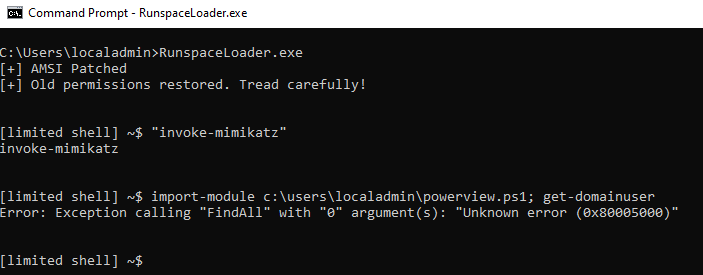
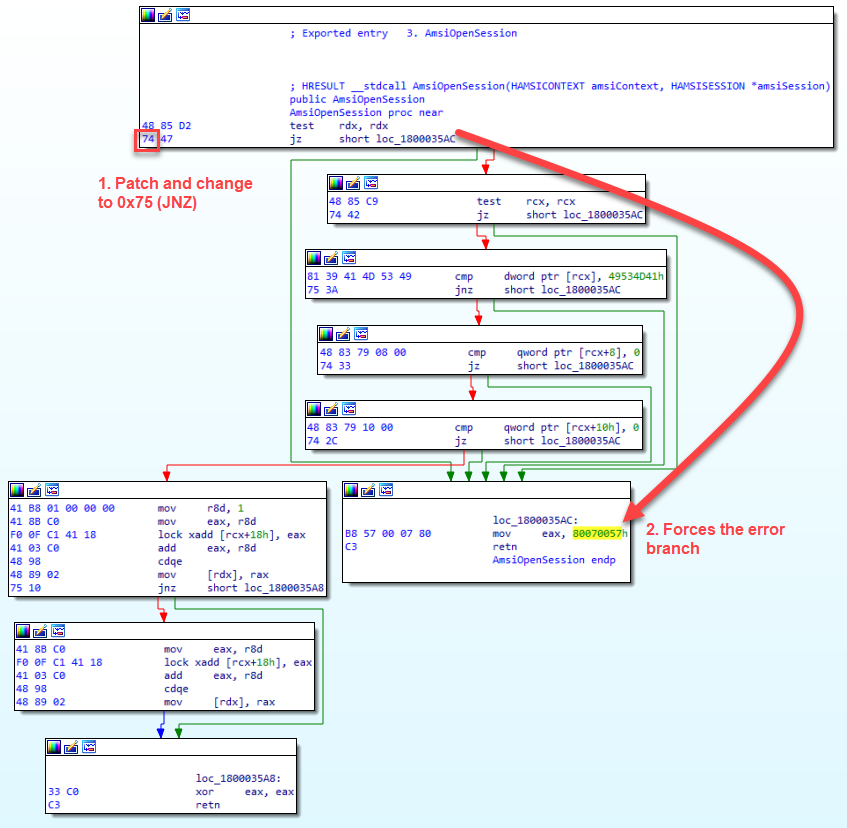

## RunspaceLoader

This is a simple implementation of PowerShell Runspaces that will allow you to run basic PowerShell commands and scripts without invoking Powershell.exe. It also includes an optional AMSI bypass that uses the AmsiOpenSession patch. The AMSI patch is optional, and can be turned off by commenting out Line 1: `#define AMSI` in `Program.cs`. 

Since this is a limited shell, no `cd` is supported. **Please read the Usage section for guidelines on how to import modules**

## Usage

*_Note: The error in the screenshot above is related to `Get-DomainUser` being called in a non-domain joined environment_ 

In order to use functions imported with `import-module`, use the following syntax

- `import-module <path-to-module>; <targetfunction>` (ie. `import-module PowerView.psm1; Find-ForeignUser` )
  
## Runspaces

 This script accepts and processes input in a loop to simulate a shell. It is a limited shell so you can't `cd` into specific directories, but it should be able to process input and scripts. I implemented a minimal custom PSHost implementation to handle output from scripts. Due to its limited capabilities, using functions loaded from `import-module` requires you to execute  `import-module <path-to-module>` in the same line as your target function (ex. `import-module PowerView.psm1; Find-ForeignUser`)  

## AMSI Patch

There are many ways to patch AMSI, but this patch aims to be minimal and effective. It starts with loading the `AmsiOpenSession` function, and replacing the first instance of `JZ` with a `JNZ` instruction in order to force the program flow into an error branch, and return the error code `0x80070057`. 

Since `AmsiOpenSession` is one of the earlier functions called when `amsi.dll` is loaded, the patch will break the execution flow before getting to the later functions that determine whether your PowerShell code is malicious or not. 

## Credits
- Special thanks to [TheD1rkMtr](https://github.com/TheD1rkMtr/) for the `C++` AMSI patch. I ported their code to `C#` for this project. (https://github.com/TheD1rkMtr/AMSI_patch)
- Special thanks to [Mr.Un1k0d3r](https://github.com/Mr-Un1k0d3r) for the weekly Patreon videos and inspiration behind creating this. (https://mr.un1k0d3r.world/portal/index.php)

